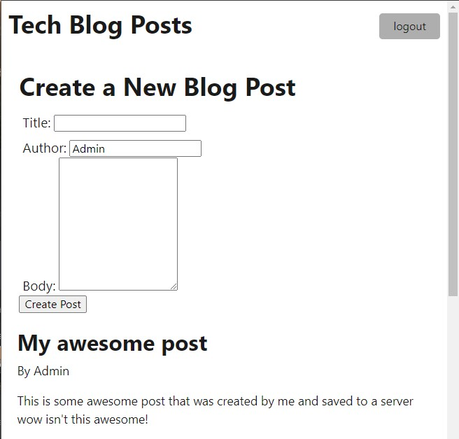

# Tech-Blog

## Description
This is a Blog Website, you can sign in using admin@admin.com with password admin1234 then you can create new posts.



## How to use
Website is not currently live. To use it download the repo/ fork the repo. In your terminal type ```mysql -u [your user] -p``` inside of mysql type ```source db/schema.sql```. Then in a bash terminal type ```npm run seed```, then ```npm start``` and in a browser open http://localhost:3001/ . 
Now you can create posts, and they are saved into the DB!

## Details
It shows all posts from all users, if you'd like to try it out login with one of these accounts or multiple up to you.
```
      "name": "Sal",
      "email": "sal@hotmail.com",
      "password": "password12345"

      "name": "Lernantino",
      "email": "lernantino@gmail.com",
      "password": "password12345"

      "name": "Amiko",
      "email": "amiko2k20@aol.com",
      "password": "password12345"

      "name": "Jordan",
      "email": "jordan99@msn.com",
      "password": "password12345"

      "name": "Blake",
      "email": "the_blake@yahoo.com",
      "password": "password12345"
```
## TODO
Add more style to the website and clean it up a bit. As well as make it live.
